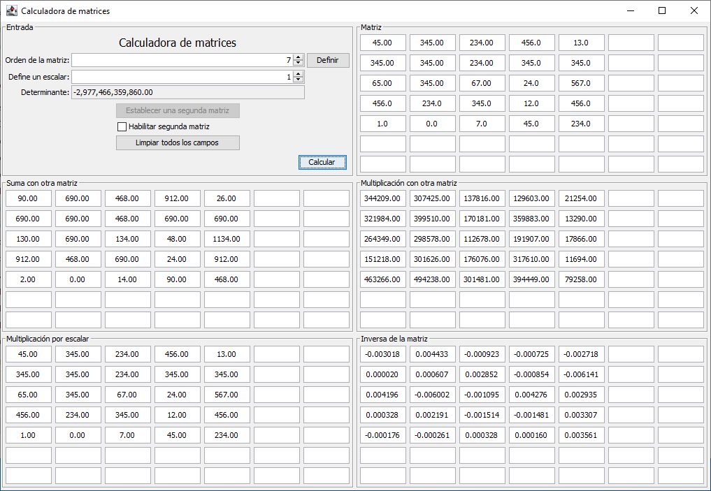
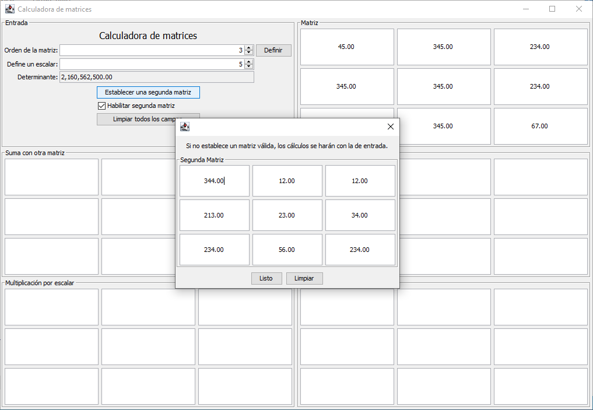
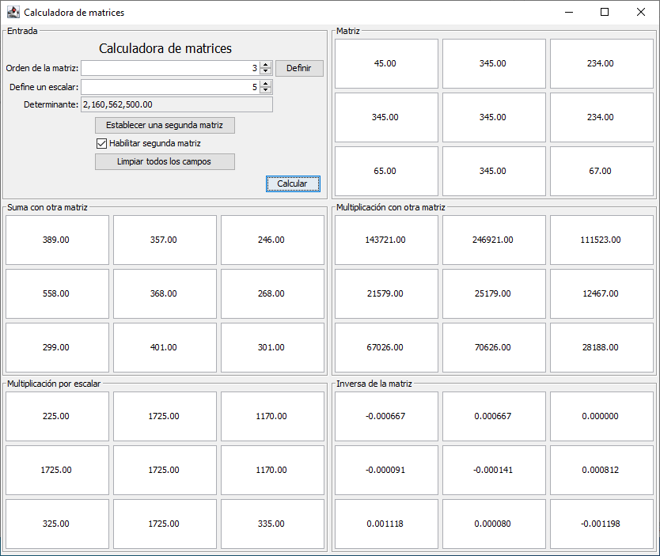

# Calculadora de Matrices

Una calculadora básica de matrices hecha con amor por Memo y Voctor.

## Ejecutar el proyecto

Se require tener instalado:

- Maven 3
- Java 8 o superior

Y ejecutamos:

```
mvn clean package
java -jar target/matrix-calculator-1.0-SNAPSHOT.jar
```

## Operaciones

Se tiene soporte para las siguientes operaciones

- Suma de matrices
- Multiplicación de matrices
- Multplicación por escalar
- Inversa de la matriz

> **Nota**: Si no se habilita la segunda matriz, todas las operaciones se hacen con la matriz primaria como secundaria.

## Capturas de pantalla

### Resultados con una matriz de orden 3


### Resultados con una matriz de orden 5



### Configuración de una matriz secundaria




